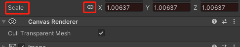

 + 前提：已经针对某个 gameobject 添加了 animator 组件，创建了 animator controller 和 animation clip
 +  让 Rect Transfrom 中 Scale 处于锁定，表示x、y、z同比例缩放
 + 
 + 在当前 animation clip 选择对应的时间点，然后右键 React Transform 中的 Scale ，在弹出列表中 add key 
  